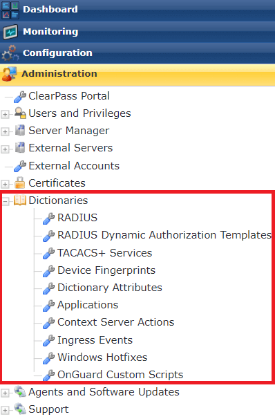

# ClearPassDictionaries

An place to store custom Aruba ClearPass dictionaries and attributes that don't exist in the ClearPass database.

These files are uploaded to ClearPass via the following location.



## Dictionaries Available
```
.
├── Application
│   └── Aruba_ALE_Application_Dictionary.xml
├── RADIUS
│   └── Splunk_RADIUS_Dictionary.xml
└── TACACS
    ├── Aruba_Airwave_TACACS_Dictionary.xml
    ├── Fortinet_Fortigate_TACACS_Dictionary.xml
    ├── PaloAlto_PanOS_TACACS_Dictionary
    ├── PPP-IP_TACACS_Dictionary.xml
    ├── shell_TACACS_Dictionary.xml
    ├── SilverPeak_TACACS_Dictionary.xml
    └── tacacs_ip_TACACS_Dictionary.xml
```
